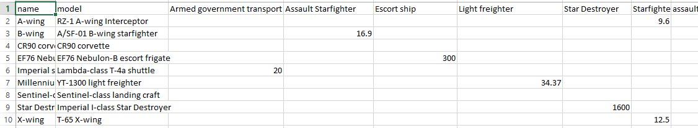

# Data Science Assignment

## Instructions:

- This is a data science assignment, you are provided with the following datasets namely: characters.csv, planets.csv, species.csv, starships.csv, vehicles.csv.
- There are 5 questions and we expect you to attempt them in order.
- Please make sure to write a **comprehensive solution** catering all the boundary and edge causes because the dataset provided to you is quite small as compared to the one on which we&#39;ll evaluate your solutions.
- The output should be exactly the same as mentioned in every question, any difference in the output format will be considered as failure of understanding the problem and conceiving the output properly.
- As this is a python based assignment we are expecting only one **your\_username.py** file. The main should only contains 5 function calls and each function should be responsible to solve and make output of its particular question. Please make sure to take care of in place changing where required as main should only contains 5 functions.
- The Assignment should not take more than 4 hours.
- Please do read point 3 again.

**Questions to be solved**

**Question 1: (**The data should be consistent**)**

You are provided with 5 data sets. When you will open them you will notice that certain fields carry not available or NA, which means the data is not available for the particular record. To overcome this we want you to drop the row whose any feature is missing.

1. Drop rows having NA in **characters.csv** and create a new output file **your\_username\_t1\_characters.csv**

1. Drop rows having NA in **planets.csv** and create a new output file **your\_username\_t1\_planets.csv**

1. Drop rows having NA in **species.csv** and create a new output file **your\_username\_t1\_species.csv**

1. Drop rows having NA in **starships.csv** and create a new output file **your\_username\_t1\_starships.csv**

1. Drop rows having NA in **vehicles****.csv **and create a new output file** your\_username\_t1\_vehicles.csv**

New output files should contain the updated data set, exclusive of all NAs and do not append the indices of the dataframes in the new files.

**Question 2: (**Aahh.. Those Green Eyes**)**

Till now you have been successfully created new files and yes you guessed it right, data set belongs to Star Wars. Consider yourself as the director of the upcoming series of the movie, and you want to cast human beings with green eyes having heights taller that 5.5 feet. Now as a good director you have to look for the top 5 tallest humans who have green eyes, from **your\_username\_t1\_characters.csv**

**Output:** (output file name should be **your\_username\_t2\_sol.csv** )

| **Name** | **Height** |
| --- | --- |
| **[**Name of 1st Person**]** | **[**Height of 1st person**]** |
| **[**Name of 2nd Person**]** | **[**Height of 2nd person**]** |
|                 …. |                 ….|
| **[**Name of 5th Person**]** | **[**Height of 5th person**]** |

**Question 3: (**I don&#39;t like outliers**)**

As you know you are about to shoot the new series of Star Wars. The list of planets you have to go, for shooting are in **your\_username\_t1\_planets.csv**

Now as a good director you want to eliminate the planets from the shooting list where population is very small. Try to eliminate those planets from the sheet whose population in 60% less than the average population of the planets, and create a new output sheet without the outliers.

**Output:** (output file name should be **your\_username\_t3\_sol.csv)**

**Question 4: (**Hey Neighbor..! I want a new car**)**

Your annoying neighbor comes to you at 9 in the morning, He knows you are making the upcoming series of star wars and you can help him out in making decision to buy his new vehicles as you have the data set. He wants to know which vehicle classes he should look for, from **your\_username\_t1\_vehicles.csv **as he wants vehicles with maximum, combined,** atmosphering speeds **and highest** passenger counts**. He is asking you to help him out. Now as you already know that you are a good director and a neighbor you&#39;ll help him finding the top 3 vehicle classes he should spend money on.

**Output:** (output file name should be **your\_username\_t4\_sol.csv** )

| **Vehicle class** | **Max atmosphering speed** | **Passengers** |
| --- | --- | --- |
| **[**name of 1st vehicle class**]** | **[**atmospheringspeed of 1st vehicle class**]** | **[**passengersof 1st vehicle class**]** |
| **[**name of 2nd vehicle class**]** | **[**atmosphering speed of 2nd vehicle class**]** | **[**passengersof 2nd vehicle class**]** |
| **[**name of 3rd vehicle class**]** | **[**atmosphering speed of 3rd vehicle class**]** | **[**passengers of 3rd vehicle class**]** |

**Question 5: (**Lights , Camera , Data Set**)**

Consider **your\_username\_t1\_starships.csv** as your input and you can observe for each starship **name** and **model** we have several **starship classes** listed with their **lengths**. Now for the final steps as good director you should take care of the following steps:

1. Drop the other features that are not used (features except the above four features).
2. Reshape the table into below format. As the producers want to see the data depending upon the   **starship classes**

**Sample Output:** (output file name should be **your\_username\_t5\_sol.csv**
Rendered
Data Science Assignment
Instructions:

